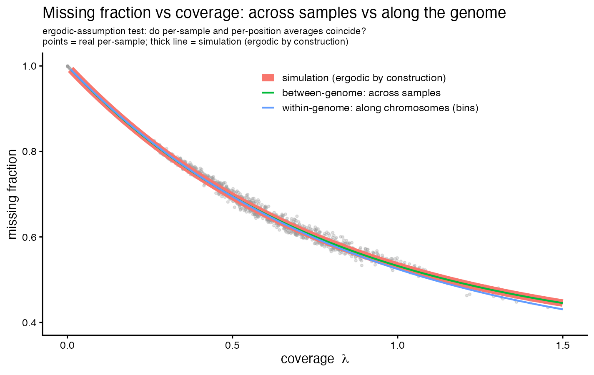

**Scope.** This note documents and defends an assumption used by the wideseq
benchmark generator (`make_wideseq_benchmark.R`): that the **per-sample** coverage
distribution can stand in for the **per-site** coverage distribution when simulating
the ~27.6M teosinte-vs-B73 wideseq sites. The motivation is practical — per-site
statistics over ~1,400 samples × ~27.6M sites is an unwieldy (sample × site) tensor,
whereas per-sample and per-bin summaries are tractable. The point of this note is to
state what is actually assumed, assess where it holds and where it does not, and lay
out how to defend it (and partly replace it with measurement) for reviewers.

**Framing — ergodic inspiration, scale-invariance claim.** The *inspiration* is ergodic:
the two axes here — the ensemble of **samples** and the sequence of **positions** (1 Mb
bins) **along the chromosomes** — play the roles of ensemble and "time," and ergodicity's
promise is that averaging *along one genome* equals averaging *across the ensemble*. That
symmetry is what motivates re-using a per-sample coverage law at the per-bin scale. But
the genomic axis is **non-stationary** (pericentromeres/repeats are systematically low),
so the process is not ergodic in the textbook sense. The rigorous, testable claim we
actually rely on is therefore narrower: that the missingness law **`missing(λ)` is
scale-invariant** — the same function whether λ varies because you picked a low-depth
*sample* or a low-mappability *region* — i.e. **λ is a near-sufficient statistic for
missingness**. Ergodicity is the analogy; scale-invariance of `missing(λ)` is the claim.

## 1. What is actually being assumed

The slogan "per-sample coverage ≈ per-site coverage" is, taken literally, false and
should not be defended as written. The defensible claim is narrower and has two parts.

1. **Within-sample exchangeability of sites within a bin.** Every wideseq site in a
   sample is modeled as accumulating reads at a common per-sample rate `λ_s`, with the
   only site-level variation being Poisson read sampling plus a structural
   "always-missing" floor `π`. There is no systematic per-site coverage structure
   (GC, mappability, local copy number) beyond that floor.

2. **Transfer of the between-sample law to the within-sample / per-bin scale.** The
   missingness curve and the coverage distribution are estimated *across samples*, then
   applied *across bins within a sample*: a low-coverage bin is assumed to behave like a
   low-coverage sample.

Named precisely, this is **scale-invariance of the missingness law**: `missing(λ)`
estimated *across samples* is the same function as `missing(λ)` *across bins within a
genome* (equivalently, λ is a near-sufficient statistic for missingness at both scales).
That is the testable core the ergodic symmetry points to — and section 4 tests it.

### What the generator does
- Per-sample mean coverage is drawn `λ_s ~ Normal(0.590, 0.226)`, floored for
  positivity. (Fit to 1,434 ZEAL wideseq samples; Normal beats Gamma and lognormal by
  AIC −192 vs +205 vs +1091; CV 0.38, skew 0.34.)
- Missingness uses the wideseq exp-floor model
  `missing(λ) = π + (1−π)·e^(−kλ)` with `π = 0.346`, `k = 1.256` (mean missingness
  ≈ 0.67), fit across samples (`missing_data.Rmd`).
- Each 1 Mb bin then draws, **analytically and without materializing individual
  variants**: `VARIANT_COUNT ~ Poisson(sites_per_mb)`, `INFORMATIVE_VARIANT_COUNT ~
  Binomial(VARIANT_COUNT, present_prob)`, `DEPTH_SUM = IVC + Poisson(IVC·(λ/present−1))`,
  `ALT_COUNT ~ Binomial(DEPTH_SUM, p_eff)`.

So `λ_s` and the population (π, k) are the only coverage inputs; every bin in a sample
shares them. That sharing is the scale-invariance assumption — the ergodic symmetry —
in operational form.

## 2. Assessment: where it is safe, where it bites

### Safe — and this is the load-bearing argument
The caller never sees a site. It consumes the **per-bin `ALT_FREQ`**, an aggregate over
~3,000–4,000 informative sites (real per-bin means: `DEPTH_SUM` ≈ 7,600 reads,
`INFORMATIVE_VARIANT_COUNT` ≈ 4,300, ≈ 1.8 reads per covered site — shallow coverage,
many sites). By the central limit theorem the bin statistic is governed by the **mean**
per-site rate (≈ `λ_s`) and the **effective site count**, not by the shape of the
per-site coverage distribution:

```
Var(ALT_FREQ) ≈ p(1 − p) / DEPTH_SUM
```

Consequently the per-site coverage decomposition is a nuisance the caller cannot
distinguish and does not need: matching the per-bin `DEPTH_SUM` and informative-site
count is sufficient to match calling behavior. The assumption is strongest exactly where
it is used — at the bin aggregation scale.

### Where it can genuinely bite
None of these is the per-sample-mean substitution itself; they are the real targets a
careful reviewer will probe.

- **Spatial coverage structure (the principal risk).** If low-coverage / low-mappability
  sites cluster — maize pericentromeres, repeats — then bins are *not* exchangeable:
  heterochromatic bins carry systematically fewer informative sites and lower depth than
  a flat `sites_per_mb` + constant `π` implies. This understates bin-to-bin variance and
  over-covers the hardest regions.
- **Reference-mapping bias against donor alleles.** Teosinte (ALT) reads map worse to the
  B73 reference, so donor sites can be under-covered and under-called — a
  coverage × genotype interaction that a genotype-independent `λ_s` ignores. This is the
  same effect that makes the 0.4× skim under-call donor, and it is what a reviewer focused
  on *introgression* calling will attack first.
- **Between → within transfer of (π, k).** The parameters are fit from *between-sample*
  variation but applied *across bins within* a sample. This is valid only if the
  missingness mechanism is the same at both scales.

## 3. How to defend it — the cheap data is the key

The same scale that makes the per-site tensor unwieldy (1,400 × 27.6M) is why it is not
needed: the **per-bin file** (`all_samples_bin_genotypes.tsv`, ~3M rows) is exactly the
granularity at which the assumption can be *tested* rather than asserted. In rough order
of impact:

1. **Reframe the claim as bin-level sufficiency, not coverage equivalence.** State that
   the inferential unit is the 1 Mb bin; the caller is a function of `ALT_FREQ` and the
   informative-site count; per-site coverage enters only through those bin aggregates;
   therefore matching the per-bin `DEPTH_SUM` / `INFORMATIVE_VARIANT_COUNT` distributions
   is sufficient. This preempts the "per-site ≠ per-sample" objection at the root.

2. **Run the direct ergodicity test (cheap, decisive).** From the per-bin file, fit
   `missing ~ π + (1−π)e^(−kλ)` *within samples across bins* and overlay it on the
   *between-sample* (π, k). If the within-sample bin-level curve coincides with the
   between-sample curve, the ergodic transfer is empirically validated — one figure
   answers the objection.

3. **Validate the aggregate, not the atoms.** Overlay the *simulated* per-bin `DEPTH_SUM`
   and `ALT_FREQ` distributions on the *real* per-bin distributions. Coincidence justifies
   the collapse at the scale that matters, irrespective of per-site detail.

4. **Where it is cheap, replace the assumption with measurement.** Instead of flat
   `sites_per_mb` + constant `π`, feed the **real per-bin marginal profile** (mean
   informative-site count and present-fraction per genomic bin, averaged over samples —
   directly computable from the per-bin file) into the generator. This neutralizes the
   spatial-structure risk and leaves ergodicity responsible only for *sub-bin* site
   behavior, which the CLT already protects. The weakest assumption becomes an empirical
   input.

5. **Pre-empt with a sensitivity analysis.** Simulate per-site rate heterogeneity (e.g.
   site rates ~ Gamma with the same per-sample mean) and show the bin-level `ALT_FREQ`
   distribution and the caller's accuracy are invariant. "We injected per-site coverage
   dispersion and bin-level inference did not move" is a refutation, not a promise.

## 4. Validation result (move 2, run on the real data)

We ran move 2 on the **real** per-bin file (`all_samples_bin_genotypes.tsv`,
1,434 samples, 3.06M bins; `agent/ergodicity_check.R` /
`agent/ergodicity_real_vs_sim.R`): fit `missing = π + (1−π)e^(−kλ)` *within genomes
across bins* and *between genomes across samples*, and compare. As a control we ran the
identical fit on the **simulation**.

| dataset | scale | n | π | k |
|---|---|---|---|---|
| **real** | within-genome (per 1 Mb bin) | 3,057,288 | 0.313 | 1.176 |
| **real** | between-genome (per sample) | 1,434 | 0.346 | 1.256 |
| simulation | within-genome (bin) | 212,900 | 0.346 | 1.255 |
| simulation | between-genome (sample) | 100 | 0.346 | 1.256 |



**Read this carefully — the test is only meaningful on real data.** The simulation is
**ergodic by construction**: `make_*_benchmark.R` draws every bin from one per-sample λ
and a flat per-bin `present_prob`, so its within- and between-genome curves are
identical to 3 decimals (Δπ ≈ 0, Δk ≈ 0.001) and recover the input (π=0.346, k=1.256)
exactly. That is the *control*, not the validation — a coincidence on simulated data
would prove nothing.

The **real data is what validates the assumption**: its within- and between-genome
curves nearly coincide too (Δπ = 0.033, Δk = 0.080), separating only slightly in the
high-λ tail (> 1×). So the missingness↔coverage law measured across samples does hold
across bins within a genome — the per-sample coverage model transfers to the per-bin
scale. The small residual (the real data being *slightly* less ergodic than the perfect
simulation: bin floor 0.313 vs sample 0.346) is exactly the genuine per-bin spatial
structure flagged below — now quantified and shown to be small.

## 5. Limitations to state honestly

- **Spatial coverage structure** (heterochromatin / repeats) — the source of the small
  real-data ergodicity residual above (Δπ ≈ 0.03); mitigated by move 4 (real per-bin
  profile); otherwise a flat per-Mb density understates bin-to-bin variance.
- **Reference bias on donor alleles** — a separate coverage × genotype term, checkable by
  asking whether `ALT_FREQ` reaches ~1.0 in known homozygous-donor regions of
  high-confidence samples; if it falls short, add an ALT-specific coverage/error term.

## 6. Bottom line

The assumption is defensible, provided the *narrow* version is defended: **bin-level
sufficiency with within-bin site exchangeability, protected by the CLT at ~10³–10⁴ sites
per bin** — not the literal "per-sample equals per-site coverage." The per-bin file lets
three of the objections become validation figures and one become a direct empirical
input, so ergodicity can be presented as *tested, and partly replaced by measurement*,
rather than assumed. The highest-value check — move 2, the within- vs between-genome
missingness-curve overlay — **has now been run on the real data and confirms the
transfer** (Δπ = 0.03, Δk = 0.08; section 4), with the simulation control showing the
expected Δ ≈ 0.

## References / artifacts
- Generator: `make_wideseq_benchmark.R` (per-bin analytic draw; `λ ~ Normal`).
- Coverage / missingness model: BzeaSeq `docs/missing_data.Rmd`
  (`λ = DEPTH_SUM/VARIANT_COUNT`; exp-floor fit), wideseq row λ=0.59, π=0.346, k=1.256.
- Per-sample λ fit: Normal(0.590, 0.226), n=1,434 (`agent/fit_wideseq_lambda.R`).
- Per-bin data for validation: `…/BZea/bzeaseq/ancestry/all_samples_bin_genotypes.tsv`.
- Caller scored against this benchmark: `score_wideseq.R` (3-state `Kgmm_HMM`).
